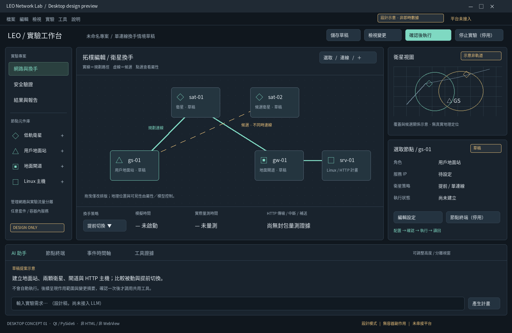
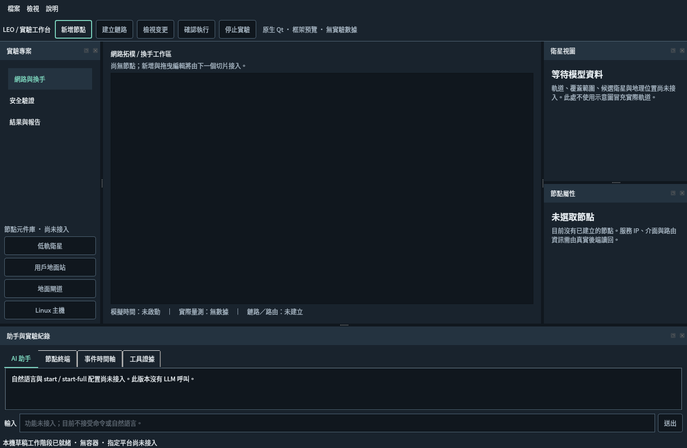

# 專題備審01｜LEO Network Lab

## 專案介紹

LEO Network Lab 是低地球軌道（LEO）衛星網路實驗專題。系統以桌面介面組織使用者終端、衛星、波束、地面閘道與應用服務等角色，並以容器化網路環境進行拓撲與流程實驗。

## UI 預覽

| 實驗工作區 | 即時觀測畫面 |
| --- | --- |
|  |  |

## 主架構

```text
Desktop UI (leo_desktop.py)
  └─ Lab orchestration (leo_lab.py / leo_flows.py)
       └─ Containernet adapter (containernet_backend.py)
            └─ Node model (src/leo_network_lab/)
                 UE → Beam → Satellite → Gateway → Server
```

本 repo 保留桌面 UI、核心拓撲模型、容器角色設定與必要 Dockerfile，作為備審展示的架構程式碼。

## 安裝說明

此公開版保留 UI 與主架構程式碼供備審閱讀；完整實驗執行仍需要未附帶的研究資料、Linux、Docker 與已安裝的 Containernet/Mininet 環境。以下為原型所需的 Python 依賴安裝方式：

```bash
python3 -m venv .venv
.venv/bin/pip install -r requirements-desktop.txt
PYTHONPATH=src .venv/bin/python leo_desktop.py
```

## 公開範圍

這是精簡的備審展示版本，不包含 `.env`、金鑰、實驗輸出、執行紀錄、第三方 vendor 資料或完整研究資料集；因此不保證能獨立完成所有實驗情境。
